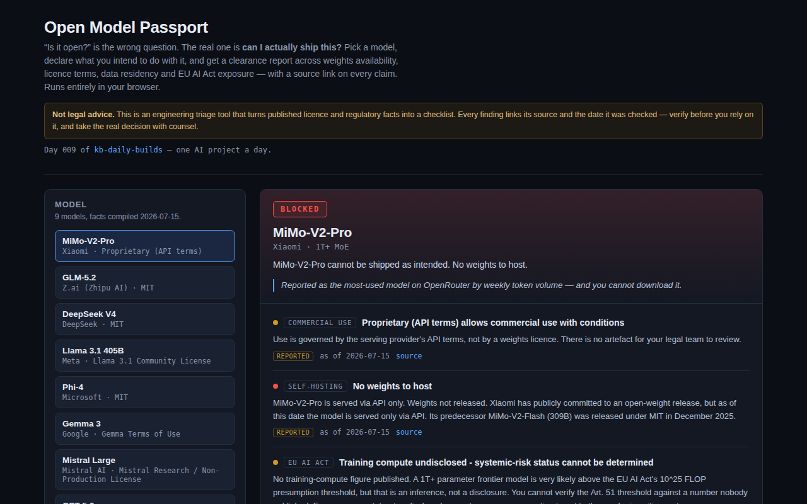

<div align="center">

# Open Model Passport

**Pick an AI model, declare what you intend to do with it, and get an instant shipping-clearance report — licence, weights, residency and EU AI Act exposure, with a source link on every claim.**

[](https://github.com/kbipul/open-model-passport/actions/workflows/ci.yml)
[](https://kbipul.github.io/open-model-passport/)

`Day 009` of **[kb-daily-builds](https://github.com/kbipul/kb-daily-builds)** — one AI project a day.

</div>

## What it does

This week a Chinese model reportedly became the most-used model on OpenRouter by weekly token volume — roughly a fifth of all traffic on the platform. It is routinely described as part of the "open model" wave. **Its weights have not been released.** You cannot download it, audit it, or run it in your own tenancy.

That gap — between what a model is *called* and what you can *legally and physically do with it* — is where procurement decisions quietly go wrong. Open Model Passport closes it. Pick a model, tick what you actually intend to do (use it commercially, self-host it, fine-tune it, redistribute it, serve EU users), and the tool returns a clearance verdict — **Clear / Conditions / Blocked** — built from published facts, each one carrying its source URL and the date it was checked.

It is not a benchmark. Everyone benchmarks models on quality and price. Almost nobody ships the boring question a Director actually has to answer before signing: *can we ship this, and who owns the conditions?*



<sub>The screenshot is captured by this repo's own CI on a GitHub runner (the build sandbox has no browser) and committed back within minutes of publish — see the `screenshot` job in `.github/workflows/ci.yml`.</sub>

> **Not legal advice.** This is engineering triage that turns published licence and regulatory facts into a checklist. Every finding links its source and its as-of date. Verify before relying on it; take the real decision with counsel.

## Try it

**[Live demo →](https://kbipul.github.io/open-model-passport/)** — runs fully in your browser, nothing to install, no API key, no network calls.

```bash
git clone https://github.com/kbipul/open-model-passport.git
cd open-model-passport
npm ci
npm test          # 38 tests
npm run dev       # http://localhost:5173/open-model-passport/
npm run build     # production build into dist/
```

## How it works

Three decisions carry the whole design.

**1. The verdict is `intent × facts`, not a static table.** A licence is not good or bad in the abstract — it is good or bad *for what you are about to do*. Mistral's non-production licence is perfectly fine until you tick "use it commercially", at which point it is a hard block. Llama 3.1 is clear until you are large enough for clause 2 to bite. So the model facts are inert data; the intent flags select which rules run.

```
ModelRecord (sourced facts)  ─┐
                              ├─►  buildPassport()  ─►  Finding[]  ─►  worst() ─► Clearance
Intent (what you want to do) ─┘      (rule engine)      per area        (blocked > conditions > clear)
```

**2. Every fact is sourced, dated and confidence-tagged.** Each `ModelRecord` field carries `{ source, asOf, confidence }`, and the UI renders all three next to the claim. `verified` means traced to a primary source (the licence text itself); `reported` means secondary reporting that I could not trace further. A compliance tool that asks you to trust it is worthless — this one asks you to check it. A test asserts that *no* finding can reach the UI without a `https://` source and an ISO date.

**3. Undisclosed is a finding, not a blank.** The EU AI Act presumes systemic risk above 10^25 training FLOP (Art. 51). Almost no provider publishes their compute — Llama 3.1 405B, at a disclosed 3.8 × 10^25, is the rare exception. The lazy move is to leave those fields empty. Instead, missing compute returns an explicit `conditions` finding: *you cannot verify a threshold against a number nobody published — put it to the vendor in writing.* Absence of evidence is rendered as absence of evidence.

## Build notes — what I learned

**The hardest call was what to do with "unknown", and it is not a technical question.** The obvious implementation returns `clear` for EU AI Act exposure when `computeFlop` is null — null looks like "nothing to report". That is exactly backwards, and I want to be precise about the scale of it: eight of the nine models I catalogued publish no training-compute figure at all, so a null-means-fine default would silently render "all good" across almost the entire dataset. I made unknown a first-class verdict instead — an explicit `conditions` finding that names the gap. That generalises well past this toy: when you encode a compliance regime in code, the null branch is where the liability hides, and it is the branch nobody writes a test for. So I wrote four.

**"Open" turns out to be four independent questions, and the industry collapses them into one.** Can you get the weights? Can you use them commercially? Can you make derivatives? Can you pass them on? Llama 3.1 answers yes/conditional/conditional/conditional. Gemma answers gated/conditional/conditional/conditional — and its Prohibited Use Policy binds not just you but everyone you distribute to, which is a genuine supply-chain obligation that almost nobody models. Mistral's research weights answer yes/**no**/conditional/no. Only MIT and Apache-2.0 models answer yes/yes/yes/yes. Once I split the single "is it open source?" boolean into four fields, the dataset started telling the truth, and the UI got more interesting for free — because now the checkboxes actually change the answer.

**Writing the dataset was 70% of the work, and I cut it deliberately.** I wanted twenty models. I shipped nine. The reason is that every row costs a real verification pass, and a compliance tool with a plausible-but-wrong row is worse than no tool — it launders a guess into a verdict. Where I could not trace a claim to primary source I tagged it `reported` and said so in the UI rather than quietly upgrading my confidence. Nine honest rows beat twenty confident ones. The `confidence` badge exists precisely because I did not want to pretend the secondary-sourced 2026 model facts are as solid as the Llama licence text I read directly.

**What I would do differently:** the dataset belongs in a versioned JSON file with a checksum and a "last reviewed" CI job that fails when a row's `asOf` goes stale past 90 days. Facts rot, and a governance tool that rots silently is a liability. Right now the `asOf` date is honest but passive — it tells you the data is old without doing anything about it. That is the obvious next iteration.

## Stack

| Layer | Choice |
|---|---|
| UI | React 18 + TypeScript 5 (strict) |
| Rule engine | Plain TypeScript — no dependencies, fully unit-tested |
| Build | Vite 5 |
| Tests | Vitest 2 + Testing Library — 38 tests (31 engine, 7 UI) |
| Hosting | GitHub Pages, 100% client-side (no network calls at runtime) |

---

<div align="center"><sub>
Built by <a href="https://www.kumarbipul.com"><b>Kumar Bipul</b></a> ·
IT Director → AI/ML · <a href="https://github.com/kbipul">github.com/kbipul</a>
</sub></div>
